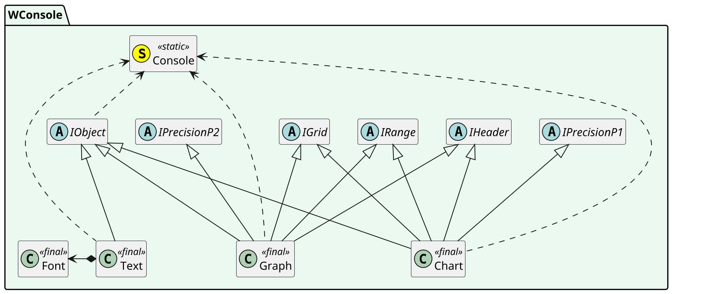

```plantuml
@startuml

scale 1920 width

hide empty members

namespace WConsole #EAFAF1 {

abstract class IGrid
abstract class IHeader
abstract class IObject
abstract class IPrecisionP1
abstract class IPrecisionP2
abstract class IRange
class Console <<(S,#FFFF00)static>>
class Chart <<final>>
class Graph <<final>>
class Text <<final>>
class Font <<final>>

Console <.. IObject
Console <... Chart
Console <... Graph
Console <... Text

IObject <|--- Chart
IObject <|--- Graph
IObject <|--- Text

IHeader <|--- Chart
IHeader <|--- Graph

IRange <|--- Chart
IRange <|--- Graph

IGrid <|--- Chart
IGrid <|--- Graph

IPrecisionP1 <|--- Chart
IPrecisionP2 <|--- Graph

Font <-* Text

}

@enduml
```